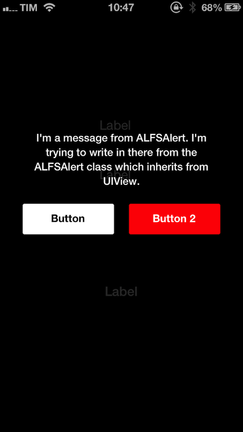

ALFullScreenAlert
=================

This is a full screen alert which is useful to display some messages to the user. You can also add one or two buttons of two different types and associate a block that will be performed when the user tap on the button.

Screenshot
=================

Usage
=================

This is an example :

    ALFSAlert *alert = [[ALFSAlert alloc] initInViewController:self];
    [alert showAlertWithMessage:@"I'm a message from ALFSAlert. I'm trying to write in there from the ALFSAlert class which inherits from UIView."];
    [alert addButtonWithText:@"Button" forType:ALFSAlertButtonTypeNormal onTap:^{
        NSLog(@"Button");
    }];
    [alert addButtonWithText:@"Button 2" forType:ALFSAlertButtonTypeDelete onTap:^{
        NSLog(@"Button 2");
    }];
